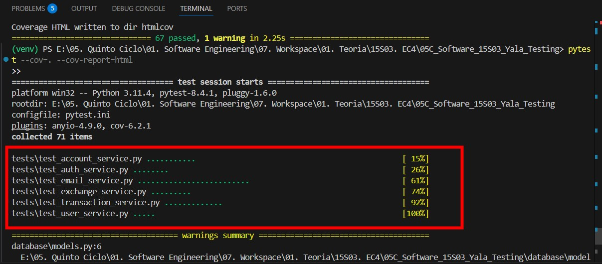
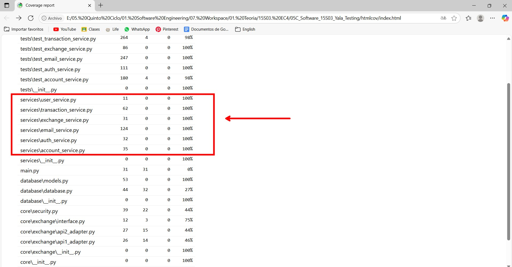
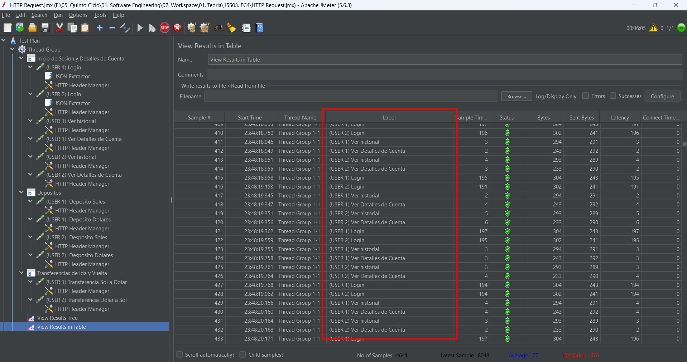
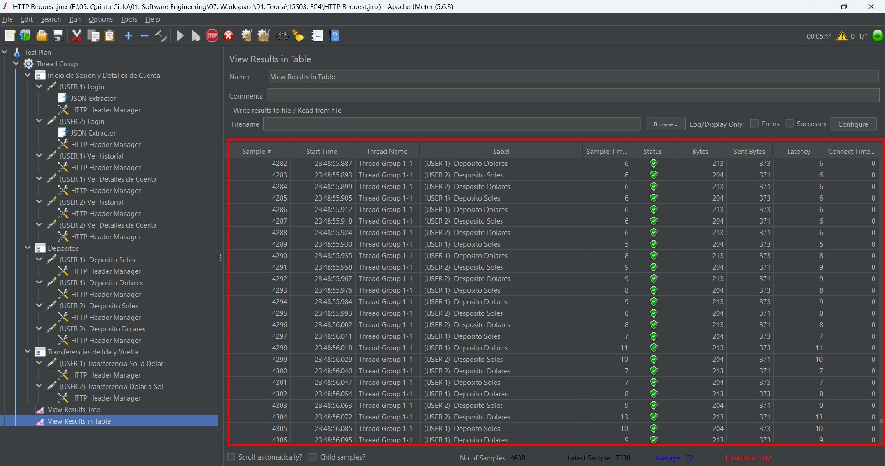
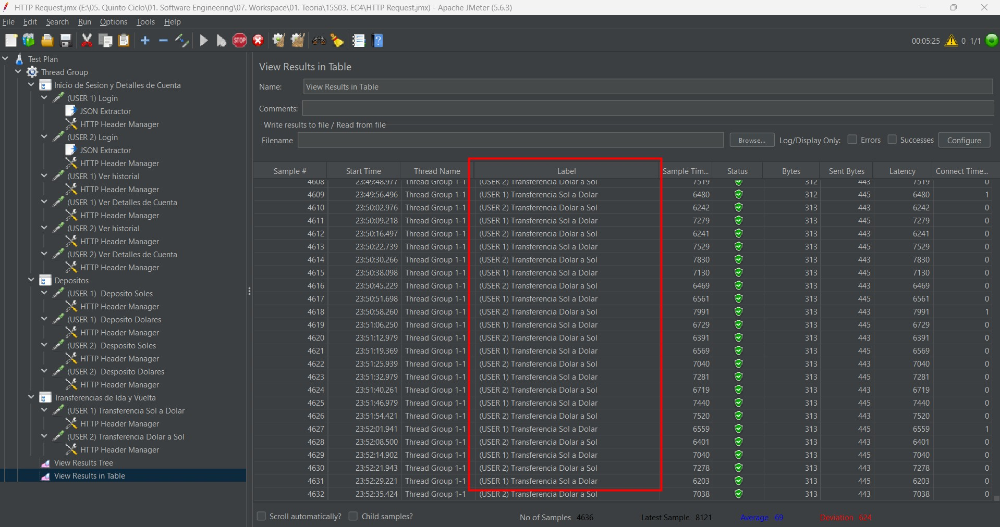
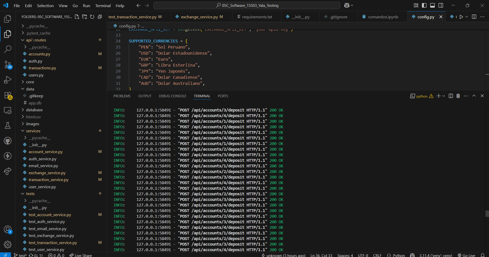
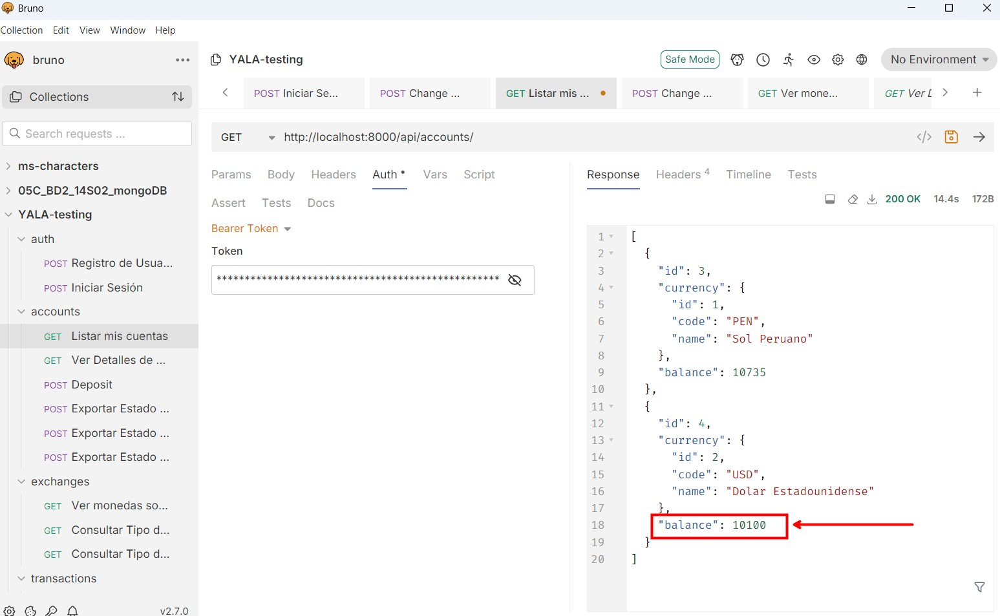
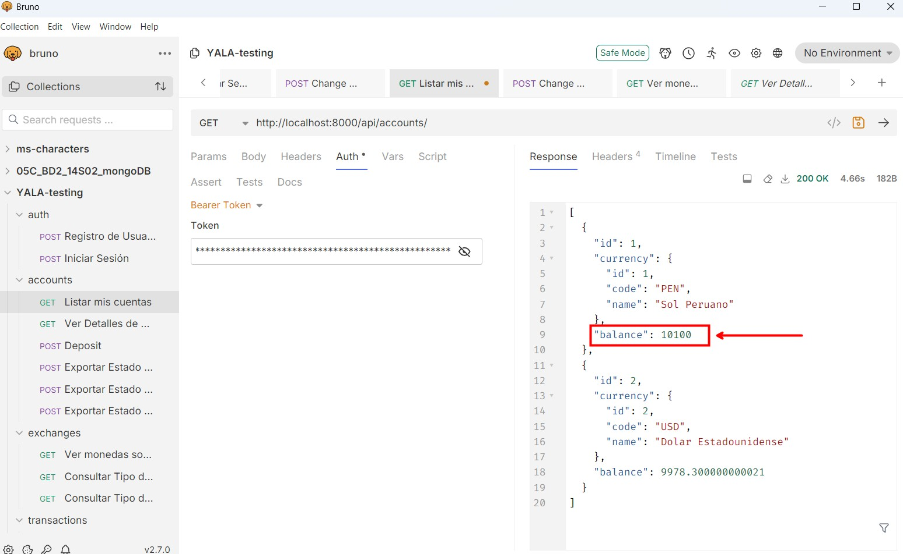

# 💸 YALA - Testing Documentation

## 📋 Descripción del Proyecto

Este documento describe la implementación de pruebas unitarias y de rendimiento para el sistema de transferencias bancarias.

---

## 🚀 Configuración Inicial

### 1️⃣ Clonar el repositorio
```bash
git clone https://github.com/Yala-Software/backend
cd backend
```

### 2️⃣ Configurar entorno virtual
```bash
python -m venv venv
source venv/bin/activate  # En Windows: venv\Scripts\activate
```

### 3️⃣ Instalar dependencias
```bash
pip install -r requirements.txt
```

### 4️⃣ Configurar variables de entorno
Crea un archivo `.env` en la raíz del proyecto con las siguientes variables:
```
JWT_SECRET_KEY=
JWT_ALGORITHM=HS256
ACCESS_TOKEN_EXPIRE_MINUTES=1440

SMTP_SERVER=smtp.gmail.com
SMTP_PORT=587
SMTP_USERNAME=proyectodbp1@gmail.com
SMTP_PASSWORD=nsfr upkz ajfa ptar
EMAIL_FROM=proyectodbp1@gmail.com

EXCHANGE_API1_KEY=  # Se obtiene registrándose en https://www.exchangerate-api.com/
EXCHANGE_API2_KEY=  # No es necesario configurar esta variable
```

### 5️⃣ Ejecutar el servidor de desarrollo
```bash
uvicorn main:app --reload
```

## 🧪 Pruebas Unitarias

### Descripción

Las pruebas unitarias se han implementado utilizando **PyTest** para garantizar la calidad y funcionalidad de los servicios del sistema. Se ha logrado un **100% de cobertura de código** en todos los servicios principales.

### Servicios Probados

- **TransactionService**: Manejo de transacciones, transferencias y validaciones
- **AccountService**: Gestión de cuentas bancarias
- **UserService**: Autenticación y gestión de usuarios
- **ExchangeService**: Conversión de monedas y tasas de cambio
- **AuthService**: Emision y recibimiento de tokens
- **EmailService**: Emision y recibimiento de email


### 1️⃣ Ejecutar el comando de pytest

```bash
pytest --cov=. --cov-report=html
```
Se mostrará una ejecución en consola como se muestra, los test son cumplidos satisfatoriamente

<div align="center">
    
</div>

### 2️⃣ Revision de Reporte

Se generará una ruta `hmtlcov\index.html`, el cual también se encuentra en el repositorio, aunque puede generarlo nuevamente

Al abrir `index.html` mostrará que la cobertura de los servicios es del `100%`

<div align="center">
    
</div>
---

## 🚀 Pruebas de Performance

### Descripción

Las pruebas de rendimiento se realizan utilizando **Apache JMeter** para validar el comportamiento del sistema bajo diferentes cargas de trabajo y escenarios de uso concurrente.


### Escenarios de Prueba

#### 🔄 Secuencia de Pruebas Diseñada

**1. Depósitos Iniciales**
- 1000 depósitos de 10 cada uno
- Distribución entre diferentes cuentas
- Validación de saldos incrementales

**2. Transferencias Simples**
- 1000 transferencias de 10 cada una
- Entre cuentas con la misma moneda
- Verificación de balances actualizados

**3. Transferencias Multi-moneda**
- Transferencias entre diferentes monedas (USD ↔ PEN, EUR ↔ USD)
- Validación de tasas de cambio aplicadas
- Verificación de consistencia en conversiones

**4. Transferencias de Ida y Vuelta**
- Transferencia A → B (con conversión de moneda)
- Transferencia B → A (conversión inversa)
- Validación de que los montos finales son consistentes

### 1️⃣ Ejecución de JMeter

Se descomprime `apache-jmeter-5.63.zip` donde se encuentra el compilado de la herramienta `JMeter`

Se ejecuta `\apache-jmeter-5.6.3\bin\jmeter.bat`

### 2️⃣ Importación de configuraciones de ejecucion

Importamos `YALA TESTING.jmx`

### 3️⃣ Realizamos la ejecucion

Se observa el rendimiento para `1000` ejecuciones

<div align="center">
    
</div>
<div align="center">
    
</div>

<div align="center">
    
</div>

Se valida que el servicio ejecute los llamados de las APIS.

<div align="center">
    
</div>


### Validación de Consistencia

#### 📊 Cálculos Esperados

Al final de la ejecución se valida en los depositos:

Si al inicio habia `100` tras ejecutar un deposito de `10` unidades, una cantidad de `1000` veces, entonces el valor total de las cuentas deberia de ser `10100`

<div align="center">
    
</div>

<div align="center">
    
</div>
